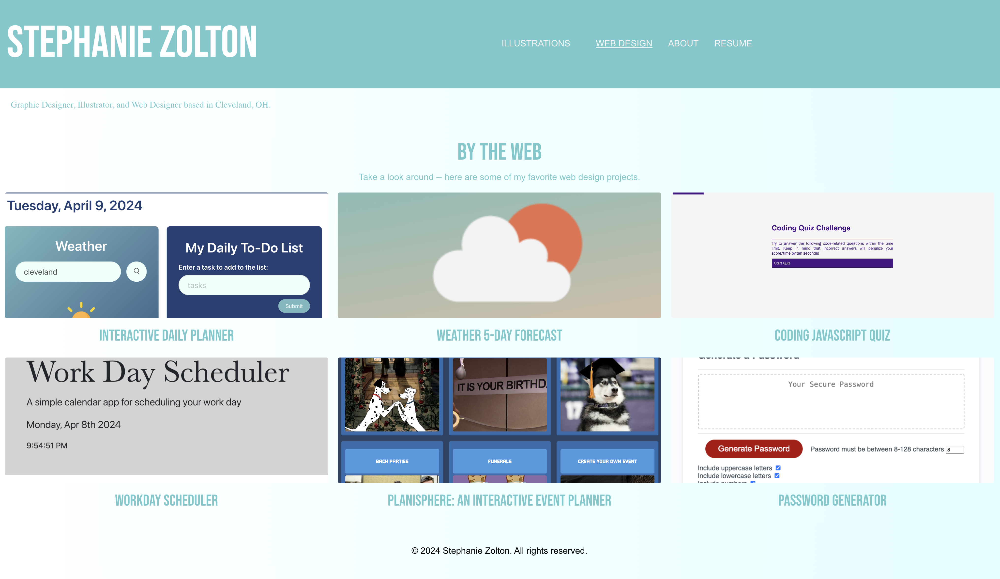
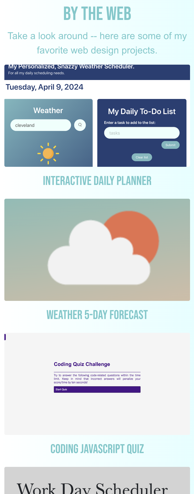
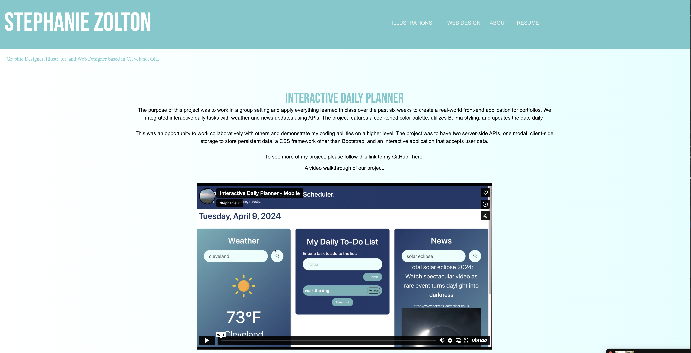
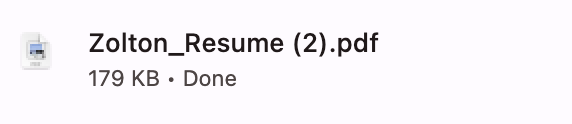

# React Challenge: React Portfolio

The purpose of this project was to create a portfolio to share my protjects, not only if I'm applying to jobs but also so I can share my work with my colleagues to help collaborate on future projects.

We were to build a page that lets the user seee the weather outlook for multiple cities, so that I can plan a trip accordingly.

The task is t ocreate a portfolio by using React, to help set you apart from other developers whose portfolios don't use the latest technologies.

# User Story
AS AN Employer looking for candidates with experience building single-page applications,
I WANT to view a potential employee's deployed React portfolio of work samples,
SO THAT I can assess whether they're a good candidate for an open position.

# Process
Fortunately, I already had a head start on this project and was able to pull from the original portfolio assignment, seen here: https://github.com/szolton/My-Design-Portfolio, and was able to switch a lot of work over to be functional with React easily. It wasn't hard, just tedious.

I followed class resources to create the Javascript, HTML, and CSS. Here are some screenshots of how my process worked. First, I grabbed colors I liked that go with my own personal creative design brand. Next, I updated the JavaScript, HTML and CSS to make a functional site with React.

Here is the About page with information on the designer (me), and how to contact me -- the email is linked.

Here's the landing page for the Web Design tab, that takes you to all of the projects I've worked on during the class that I enjoyed the most.

The page is also responsive and works well on a mobile device.

The page is also responsive and works well on a mobile device.

Here's an example of a page once you click on it -- this takes you to the Interactive Daily Planner page that talks about my work and process on this project.

My resume is also downloadable automatically if you click on the resume link in the navigation:

# In conclusion

I set up a portfolio using react for a web developer. I:
- When I load the portfolio, THEN I am presented with a page containing a header, content,  and a footer
- WHEN I view the header, I'm presented with the developer's name and navigation with titles corresponding to different sections of the portfolio
- WHEN I view the navigation titles, THEN I am presented with titles About Me, Portfolio, Contact, and Resume, and the title corresponding to the current section is highlighted
- WHEN I click on a navigation title, THEN I am presented with the corresponding section below the navigation without the page reloading and that title is highlighted
- WHEN I am presented with the About Me section, THEN I see a recent photo or avatar of the developer with a short bio
- WHEN I am presented with the Portfolio section, I see titled images of the developer's applications with links to both deployed applications and corresponding GitHub repository
- WHEN I am presented with the Resume section, THEN I see a link to a downloadable resume and a list of the developer's proficiencies

Please follow this link to my GitHub to see the code: https://github.com/szolton/Design-Portfolio

OR 

Find the fully deployed site here: https://zoltondesign.netlify.app.

Thank you!